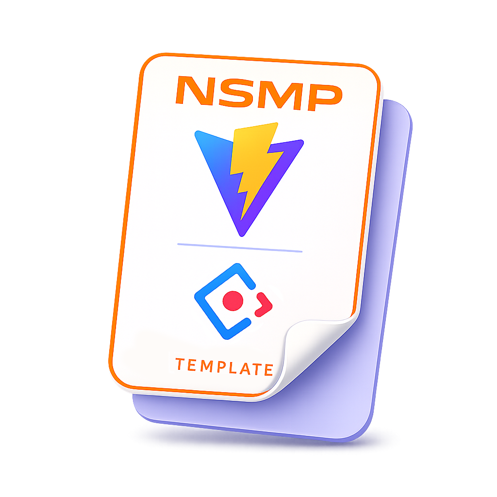

# NSMP Ant App Template
> Шаблон встроенного веб-приложения на Vue 3 и Ant Design Vue для NSMP


[](https://opensource.org/licenses/MIT)


<p align="center">
  
</p>

> [!TIP]
> Шаблон использует форк библиотеки [`@nsmp/js-api`](https://github.com/ErilovNikita/js-api), адаптированный под работу с `Vue`.

## Основные возможности
- Vue 3 Composition API
- UI на Ant Design Vue
- Интеграция с `@nsmp/js-api`
- Готовые контроллеры для форм, таблиц, модалок, алертов и вкладок
- Универсальный localStorage-кэш для данных формы


## Быстрый старт
```sh
git clone https://github.com/ErilovNikita/nsmp-ant-app-test.git
cd nsmp-ant-app-test
npm install
npm link @nsmp/js-api
npm run dev
```

## Документация
Красивая версия документации публикуется через VitePress:
- [Открыть документацию](https://erilovnikita.github.io/nsmp-ant-app-template/)
- [Локальная документация](docs/)

Локальный запуск:
```sh
npm run docs:dev
```
